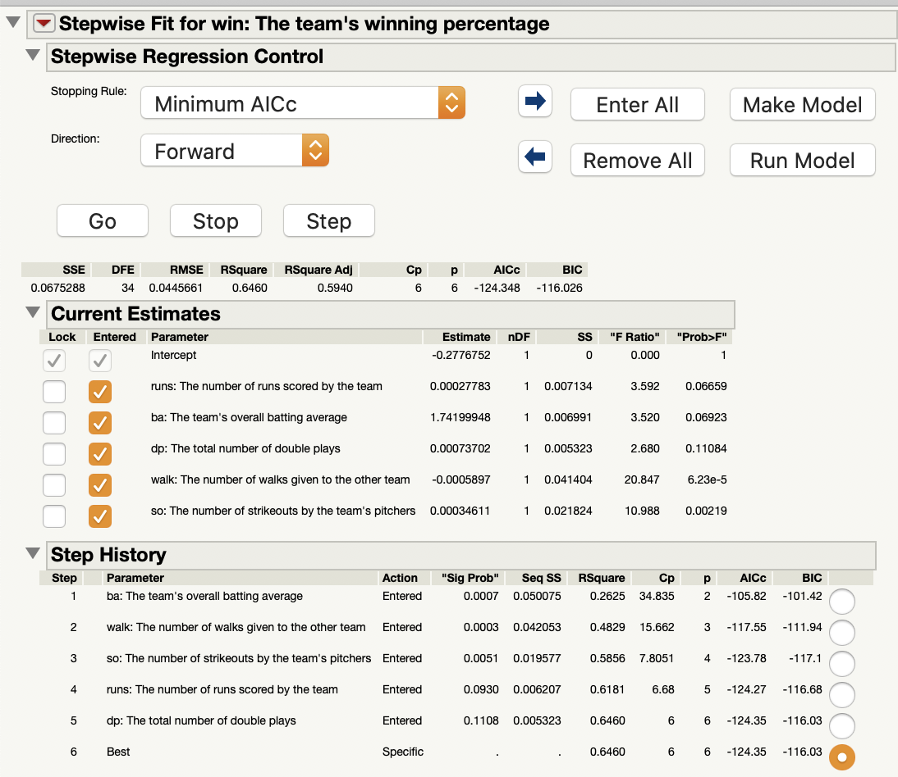

```{r setup, include=FALSE}
knitr::opts_chunk$set(echo = TRUE)
```

### Import Data
```{r import, echo=TRUE}
library(readxl)
data <- read_excel("Midtest_Data.xlsx")
names(data)[3] <- "win" 
names(data)[4] <- "runs"
names(data)[5] <- "ba"
names(data)[6] <- "dp"
names(data)[7] <- "walk"
names(data)[8] <- "so"
attach(data)
```


# Question 10.1
Use the forward selection method to fit the best multiple linear regression model (AICc) for the response variable percentage of winning. Do not take the variable year into your predictor variable.

### Solution
The forward selection below for R uses AIC to find the best multiple linear regression model for the response variable percentage of winning.
```{r 10.1, echo=TRUE}
fit10.1 <- lm(win~1, data=data)
step.for <- step(fit10.1, direction="forward", scope=~runs+ba+dp+walk+so)
summary(step.for)
```

The forward selection starts with no predictors in the model and adds the best predictors until the addition of another predictor is not statistically significant. The output shows that the model with the minimum AIC is the last model with all the predictors (ba, walk, so, runs, and dp). This model has an AIC value of -243.36.  
Since the R function uses AIC instead of AICc, I included the JMP output as well, since JMP uses minimum AICc. Here is the output for JMP:
```{r jmp10.1, echo=FALSE, out.width = '100%'}
#output from jmp forward selection

```
The best model in JMP also included all the predictors and had an AICc value of -124.35.


\newpage
# Question 10.2
Discuss the significance of your fitted model. Your interpretation should include the test statistic and the p-value.

### Solution
The model below represents the model chosen in the forward selection process in question 10.1.
```{r 10.2, echo=TRUE}
model <- lm(formula = win ~ ba + walk + so + runs + dp, data = data)
summary(model)
```
The equation for the model is $y_{win}$ = -0.2777 + 1.7420(ba) - 0.0006(walk) + 0.0003(so) + 0.0003(runs) + 0.0007(dp).

The null hypothesis for the test of significance of a linear regression model is that the all the coefficients equal 0. The alternative hypothesis is that at least one of the coefficients does not equal 0. Rejection of the null hypothesis implies that at least one predictor contributes to the model.   


#### F Test Statistic   

  The summary of the model shows that the calculated F statistic is 12.41 with degrees of freedom 5 and 34. The critical F value for those degrees of freedom on a significance level of 0.05 is 2.49. Since 12.41 > 2.49, then we reject the null hypothesis at significance level 0.05. This means that at least one of the predictors in the model  contributes significantly to a team's winning percentage.  

#### P-Value  

  The p-value of the model is shown above as 6.86e-07. Since this value is significantly less than 0.05, then we reject the null hypothesis. This means that we have further proof that at least one of the predictors in the model contributes significantly to a team's winning percentage.


\newpage
# Question 10.3
Use t-tests to assess the contribution of each predictor to the model. Discuss your findings.

### Solution
The null hypothesis for testing any individual regression coefficient is that the coefficient equals 0. The alternative hypothesis that the coefficient does not equal 0. If the null hypothesis is not rejected, then that predictor is not statistically significant to the model.  The value from the t-test of each predictor is shown in the "t value" column in the output shown in Question 10.2. The critical t-value that each value will be compared to from a significance level of 0.05 is $t_{0.025,34} = \pm$ 2.0322.  

Therefore, the rejection region is -2.0322 > x or x > 2.0322.  

**Predictors**:  
  **ba:** The t-value of the batting average predictor (ba) is 1.876. Since -2.0322 < 1.876 < 2.0322, then we fail to reject the null hypothesis, and the predictor is not statistically significant.
  
  **walk:** The t-value of the number of walks given predictor (walk) is -4.566. Since -4.566 < -2.0322, then we reject the null hypothesis, and the predictor is statistically significant.
  
  **so:** The t-value of the number of strikeouts predictor (so) is 3.315. Since 3.315 > 2.0322, then we reject the null hypothesis, and the predictor is statistically significant.
  
  **runs:** The t-value of the number of runs scored predictor (runs) is 1.895. Since -2.0322 < 1.895 < 2.0322, then we fail to reject the null hypothesis, and the predictor is not statistically significant.
  
  **dp:** The t-value of the number of number of double plays predictor (dp) is 1.637. -2.0322 < 1.637 < 2.0322, then we fail to reject the null hypothesis, and the predictor is not statistically significant.

The intercept coefficient is also not statistically significant. Therefore, the only statistically significant predictors in the model are the number of walks given (walk) and the number of strikeouts (so).
We could have also used the "Pr(>|t|)" value in the output of Question 10.2. If the value is less than the significance level 0.05, then it is statistically significant. This also shows that the only statistically significant predictors in the model are walk and so.

\newpage
# Question 10.4
Give the 95% confidence interval (CI) on the mean percentage of winning for the runs=707, ba=0.254, dp=152, walk=467, sa=916. Your answer must include the formula for calculating the CI. (You do not have to use all the values if your best model does not contain the corresponding variables.)

### Solution
The estimate of winning percentage for the specified data and its 95% confidence interval are calculated below.
```{r 10.4, echo=TRUE}
new.data <- data.frame(runs=c(707),ba=c(0.254), dp=c(152), walk=c(467), so=c(916))
predict(model, newdata=new.data, interval="confidence", se=T, level=0.95)
```

The 95% confidence interval on the mean percentage of winning for the given data is shown in the output above as (0.490, 0.539). This can be calculated by using the confidence interval formula,

$\Big(\hat{y}(x_0)-t_{\alpha/2,n-p}\sqrt{\hat{\sigma}^{2}x'_{0}(\textbf{X'X})^{-1}x_0},\hat{y}(x_0)+t_{\alpha/2,n-p}\sqrt{\hat{\sigma}^{2}x'_{0}(\textbf{X'X})^{-1}x_0}\Big)$.

Since the standard error for the confidence interval is
$se(\hat{y}(x_0)) = \sqrt{\hat{\sigma}^{2}x'_{0}(\textbf{X'X})^{-1}x_0}$
then the confidence interval equation can be simplified to
$\Big(\hat{y}(x_0)-t_{\alpha/2,n-p}se(\hat{y}(x_0)),\hat{y}(x_0)+t_{\alpha/2,n-p}se(\hat{y}(x_0))\Big)$.

The estimate of the winning percentage for the given data is shown above as 0.5149. This can be calculated by plugging the new data into the equation for the model, 

$\hat{y}(x_0)$ = -0.2777 + 1.7420(ba) - 0.0006(walk) + 0.0003(so) + 0.0003(runs) + 0.0007(dp). 

The standard error of the estimate is shown in the output above as 0.0120. The t-value for the model is $t_{\alpha/2,n-p} = t_{0.025,34} = 2.032$. If we substitute all the values in the confidence interval equation, we get

CI = $(0.5149-2.032*0.01203,0.5149+2.032*0.01203)\\$
CI = (0.490, 0.539).


\newpage
# Question 10.5
Give the 95% prediction interval (PI) on a new observation of the percentage of winning for the runs=707, ba=0.254, dp=152, walk=467, sa=916. Your answer must include the formula for calculating the PI. (You do not have to use all the values if your best model does not contain the corresponding variables.)

### Solution
The 95% prediction interval and the model's $\sigma^2$ value are calculated below.
```{r 10.5, echo=TRUE}
predict(model, newdata=new.data, interval="predict", level=0.95)
summary(model)$sigma^2
```

The 95% prediction interval of the percentage of winning for the given data is shown in the output above as (0.421, 0.609). This can be calculated by using the prediction interval formula,

$\Big(\hat{y}(x_0)-t_{\alpha/2,n-p}\sqrt{\hat{\sigma}^{2}[1+x'_{0}(\textbf{X'X})^{-1}x_0]},\hat{y}(x_0)+t_{\alpha/2,n-p}\sqrt{\hat{\sigma}^{2}[1+x'_{0}(\textbf{X'X})^{-1}x_0]}\Big)$.

Since the standard error for the prediction interval is
$se(\hat{y}(x_0)) = \sqrt{\hat{\sigma}^{2}[1+x'_{0}(\textbf{X'X})^{-1}x_0]}$
then the prediction interval equation can be simplified to
$\Big(\hat{y}(x_0)-t_{\alpha/2,n-p}se(\hat{y}(x_0)),\hat{y}(x_0)+t_{\alpha/2,n-p}se(\hat{y}(x_0))\Big)$.

The estimate of the winning percentage for the given data is calculated in Question 10.5 as 0.5149. The t-value for the model is $t_{\alpha/2,n-p} = t_{0.025,34} = 2.032$.

The standard error for the prediction interval can be calculated using the standard error from the confidence interval, which was 0.0120. Using the $\sigma^2$ value of the model of 0.001986 from the output above, the prediction interval standard error can be calculated by
$se(\hat{y}(x_0)) = \sqrt{0.001986+0.0120^2} = 0.0462$.

If we substitute all the values in the prediction interval equation, we get

PI = $(0.5149-2.032*0.0462,0.5149+2.032*0.0462)\\$
PI = (0.421, 0.609).


# Question 10.6
Compare the results from part 4 and part 5. Which interval has a longer interval length? Explain the reason.

### Solution
Recall that the confidence interval from Question 10.4 is (0.490, 0.539), and the prediction interval from Question 10.5 is (0.421, 0.609). The prediction interval appears to have a longer interval length, where the upper and lower limits between the two intervals have a difference of 0.07. The reason that the PI's interval is wider than the CI's interval is because the standard error for the PI is larger. The standard error for the PI is larger because the PI is predicting an individual value while a CI is predicting a mean value. Therefore, there is more uncertainty in a PI's standard error, so a larger standard error, and thus a wider interval. 


\newpage
# Question 10.7
Let lag=15, calculate the Sample ACF, the corresponding Z-Statistic, and Ljung-Box Statistic of the percentage of winning. The output should be similar to the Table 2.3 on page 71 in the textbook. It will be fine if your outputs include all information contained in Table 2.3. The values of ACF, Z-statistic, and Ljung-Box statistic are needed. Is there an indication of non- stationary behavior in the residuals?

### Solution
The table above shows the Sample ACF, corresponding Z-Statistic, and Ljung-Box Statistic of the percentage of winning for each lag 1 to 15. 
```{r 10.7, echo=TRUE}
ts <- ts(data$win, frequency=10, start=c(1965,1))
y <- acf(data$win, lag.max = 15, type="correlation", main="ACF of Winning Percentage")
lag <- c(1:15)
acf.values <- y$acf[2:16]
tab <- data.frame(Lag=lag, Sample.ACF= acf.values)
T <- dim(data)[1]
K <- 15
Z.Statistic <- (tab$Sample.ACF)*sqrt(T)
tab <- cbind(tab, Z.Statistic)
# ljung <-function(ts) {
#   for(i in c(1:K)) {
#     box<-(Box.test(data[3], lag=i, type="Ljung-Box")) 
#     LjungBox.Statistic <- c(LjungBox.Statistic, box$statistic)
#     return(LjungBox.Statistic)}
# }
#couldn't get function to work so I wrote out manually
LjungBox.Statistic = c()
box<-(Box.test(data[3], lag=1, type="Ljung-Box")) 
LjungBox.Statistic <- c(LjungBox.Statistic, box$statistic)
box<-(Box.test(data[3], lag=2, type="Ljung-Box")) 
LjungBox.Statistic <- c(LjungBox.Statistic, box$statistic)
box<-(Box.test(data[3], lag=3, type="Ljung-Box")) 
LjungBox.Statistic <- c(LjungBox.Statistic, box$statistic)
box<-(Box.test(data[3], lag=4, type="Ljung-Box")) 
LjungBox.Statistic <- c(LjungBox.Statistic, box$statistic)
box<-(Box.test(data[3], lag=5, type="Ljung-Box")) 
LjungBox.Statistic <- c(LjungBox.Statistic, box$statistic)
box<-(Box.test(data[3], lag=6, type="Ljung-Box")) 
LjungBox.Statistic <- c(LjungBox.Statistic, box$statistic)
box<-(Box.test(data[3], lag=7, type="Ljung-Box")) 
LjungBox.Statistic <- c(LjungBox.Statistic, box$statistic)
box<-(Box.test(data[3], lag=8, type="Ljung-Box")) 
LjungBox.Statistic <- c(LjungBox.Statistic, box$statistic)
box<-(Box.test(data[3], lag=9, type="Ljung-Box")) 
LjungBox.Statistic <- c(LjungBox.Statistic, box$statistic)
box<-(Box.test(data[3], lag=10, type="Ljung-Box")) 
LjungBox.Statistic <- c(LjungBox.Statistic, box$statistic)
box<-(Box.test(data[3], lag=11, type="Ljung-Box")) 
LjungBox.Statistic <- c(LjungBox.Statistic, box$statistic)
box<-(Box.test(data[3], lag=12, type="Ljung-Box")) 
LjungBox.Statistic <- c(LjungBox.Statistic, box$statistic)
box<-(Box.test(data[3], lag=13, type="Ljung-Box")) 
LjungBox.Statistic <- c(LjungBox.Statistic, box$statistic)
box<-(Box.test(data[3], lag=14, type="Ljung-Box")) 
LjungBox.Statistic <- c(LjungBox.Statistic, box$statistic)
box<-(Box.test(data[3], lag=15, type="Ljung-Box")) 
LjungBox.Statistic <- c(LjungBox.Statistic, box$statistic)
tab <- cbind(tab, LjungBox.Statistic)
print.data.frame(tab)
```
```{r z, echo=TRUE}
#Critical Z Statistic
zc <- qnorm(1-0.05/2)
zc
```

#### Z-Statistic
The null hypothesis for the Z statistic is that $\rho_k = 0$, and the alternative hypothesis is that $\rho_k \ne 0$. We reject the null hypothesis if the absolute value of the Z Statistic in the table above is greater than the critical Z statistic 1.96 (calculated above using significance level 0.05). The individual ACFs that we reject based on their Z statistics are of lags 1, 6, and 10. These values are an indication of non-stationary behavior

### Ljung-Box Statistic
The Ljung-Box goodness-of-fit statistic gives the group test of ACF. If the value at row j is bigger than the critical value of chi-squared at j, then we reject the null hypothesis that all ACF values up to j are 0. At lag 15, $Q_{LB,15}$ = 61.3146. The critical QB value at lag 15 is shown below as 24.99.
```{r qb, echo=TRUE}
#Critical QB Statistic at 15
qb_15 <- qchisq(1-0.05,15)
qb_15
```
Since the critical value at lag 15 is less than the Ljung-Box value at lag 15, then we reject the null hypothesis. Therefore we cannot define all the ACF values up to j as 0, which is another indication of non-stationary behavior.


\newpage
# Question 10.8
Let the lag=15, calculate the variogram of the percentage of winning. What can you tell from the variogram?

### Solution
The variogram of the percentage of winning for lag = 15 is shown below.
```{r 10.8, echo=TRUE}
variogram_func <- function(x, lag) {
  x <- as.matrix(x) # Make sure the x is a vector. It represents the     observations of y_t. 
  Lag <- NULL
  var_k <- NULL
  vario <- NULL
  for (k in 1:lag) {
    Lag[k] <- k
    var_k[k] <- sd(diff(x, k))^2 
    vario[k] <- var_k[k] / var_k[1]
  }
  return(as.data.frame(cbind(Lag, vario))) 
}

x <- ts
lag <- 15
lag_readings <- 1:lag
z <- variogram_func(x, lag)
variogram_readings <- z$vario
plot(lag_readings, variogram_readings, type="o", col="dark red", 
     main="Variogram of Winning Percentage")
```

The variogram shows that the data increases but then dips very low at lag 10. Since the data does not converge to a level and then fluctuate around it, then it is not stationary.

\newpage
# Question 10.9
Plot the 4 in 1 residual plots (QQ plot, Fitted value vs Residual, Histogram of Residual, and Observation order vs Residual) and interpret the graphs. The graphs should be similar to Figure 3.1 on page 138 in the textbook.

### Solution
The plots below are the residual plots from the model created in the first half of the questions.
```{r 10.9, echo=TRUE}
par(mfrow = c(2, 2), oma = c(0, 0, 0, 0))
qqnorm(model$residuals, datax = T, pch = 16, xlab = "Residual", main = "") 
qqline(model$residuals, data = T)
plot(model$fitted.values, model$residuals, pch = 16,
xlab = "Fitted Value", ylab = "Residual") 
abline(h = 0)
hist(model$residuals, col = "grey", xlab = "Residual", main = "") 
plot(model$residuals, type = "l", xlab = "Observation Order", ylab = "Residual") 
points(model$residuals, pch = 16, cex = .5)
abline(h = 0)
```

#### QQ Plot
The first plot is the QQ Plot or Normal Probability Plot. The residuals generally follow along a straight line, so the normality assumption still stands. The lower half of the line strays a little bit from the line, but I don't think it's any reason to be too concerned.

#### Fitted Value vs. Residuals
The second plot is the Fitted value vs. Residual plot. The plot at first glance might not appear to be randomly scattered since the lower end of the x-axis doesn't have many points, but the scatter does not have a funnel shape since both ends of the x-axis have less points. Therefore, the plot has a random scatter, and the constant variance assumption is satisfied.

#### Histogram of Residuals
The third graph is the histogram of the residuals. The histogram shows a normal distribution since the frequencies follow a bell curve-like shape. Therefore, the histogram does not give any serious indication of non-normality.

#### Observation Order vs. Residuals
The last graph is the plot of observation order vs. residuals. The plot appears to be randomly scattered, therefore there are not any model inadequacies.

\newpage
# Question 10.10
Discuss the model adequate by analyzing the residuals. Your output should be similar to the table 3.7 on page 141 in the textbook. Based on your outputs, answer the following questions: Are there any outliers? High leverage observations? High influential observations? Use criterions given in the textbook.

### Solution
The table below shows the Residuals, Studentized Residuals, R-students, $h_{ii}$ values, and Cook's Distance values for each observation in our model.
```{r 10.10, echo=TRUE}
studres <- rstandard(model)
res <- data.frame(Residuals= model$residuals, Studentized.Residuals=studres)
library(MASS)
rstudent <- studres(model)
res <- cbind(res, R.Student=rstudent)
hi <- hatvalues(model)
res <- cbind(res, hii=hi)
cookd <- cooks.distance(model)
res <- cbind(res, CooksDistance=cookd)
print.data.frame(res)
```

If the studentized residual does not fall within the range -3 to 3, then the observation is an outlier. Since all of the values fall within that range, then there are no outliers. An observation is considered influential if its Cook's Distance value is greater than 1. Since none of the Cook's Distance values in the table above are greater than 1, then none of the observations are influential. An observation is considered high-leverage if the $h_{ii}$ value exceeds $\frac{2p}{n}$. This value is calculated below as 0.30.

```{r leverage, echo=TRUE}
high <- 2*6/40
high
```

Observations 4, 13, and 26 are all considered high leverage because their $h_{ii}$ value in the table above is greater than 0.30. This means that they have "extreme" predictor x values.


